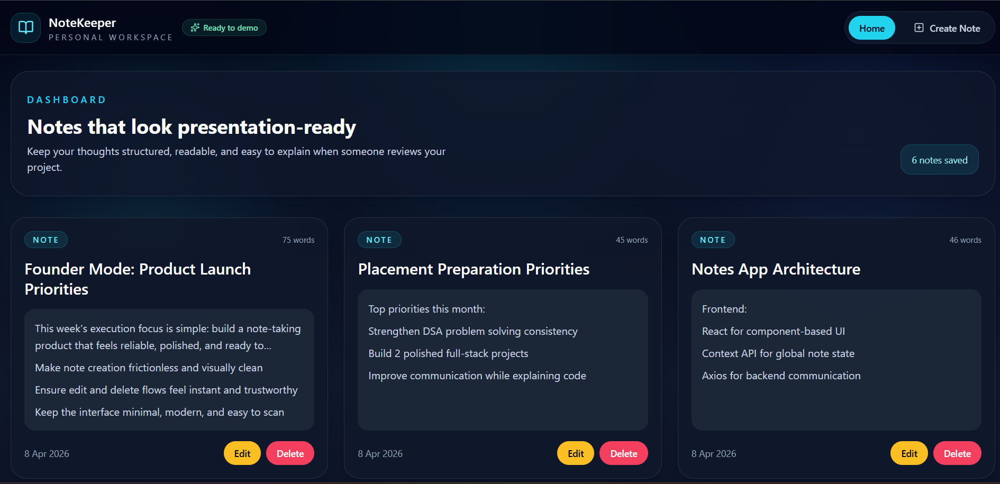

# NoteKeeper


A full-stack note taking app built with React, Vite, Tailwind CSS, Express, and MongoDB. NoteKeeper lets users create, view, edit, and delete notes through a clean dashboard-style interface designed for demos, projects, and portfolio showcases.

## Demo Status

- Live demo: Coming soon
- Local development: Fully supported
- Best use case: Portfolio project, CRUD practice, and full-stack revision

## Preview



Clean dashboard view with responsive note cards, inline actions, and a polished demo-ready layout.

## Highlights

- Create notes with title and content validation
- View all saved notes in reverse chronological order
- Edit notes directly from the dashboard
- Delete notes instantly
- Responsive UI with polished cards, empty states, and a dedicated create page
- Centralized React context for note state management
- REST API powered by Express and MongoDB

## Why This Project Stands Out

- Clean full-stack CRUD architecture that is easy to explain in interviews
- Modern UI that looks better than a basic beginner project
- Separated frontend and backend structure for real-world project organization
- Good foundation for adding auth, search, tags, and deployment later

## Tech Stack

**Frontend**
- React 19
- Vite
- Tailwind CSS
- React Router
- Axios
- Lucide React

**Backend**
- Node.js
- Express
- MongoDB
- Mongoose
- dotenv
- cors

## Project Structure

```text
note taking app/
|-- backend/
|   |-- controllers/
|   |-- models/
|   |-- routes/
|   |-- index.js
|   `-- package.json
|-- frontend/
|   |-- src/
|   |   |-- api/
|   |   |-- components/
|   |   |-- context/
|   |   `-- pages/
|   |-- public/
|   `-- package.json
|-- docs/
|   `-- images/
`-- README.md
```

## Features In The UI

- `Home` page to display all notes
- `Create Note` page for adding a new note
- Inline edit support on each note card
- Word count and created date on note cards
- Empty-state screen when no notes are available

## API Endpoints

Base route:

```text
/api/v1/noteapp
```

Available endpoints:

- `POST /create-note` - create a new note
- `GET /get-notes` - fetch all notes
- `PUT /update-note/:id` - update an existing note
- `DELETE /delete-note/:id` - delete a note

## Environment Variables

Create a `.env` file inside `backend/`:

```env
MONGO_URL=your_mongodb_connection_string
PORT=4002
```

Create a `.env` file inside `frontend/`:

```env
VITE_BACKEND_URL=http://localhost:4002/api/v1/noteapp
```

## Run Locally

### 1. Clone the repository

```bash
git clone <your-repository-url>
cd "note taking app"
```

### 2. Install dependencies

```bash
cd backend
npm install
```

```bash
cd ../frontend
npm install
```

### 3. Start the backend

From the `backend` folder:

```bash
npm start
```

The server runs on:

```text
http://localhost:4002
```

### 4. Start the frontend

From the `frontend` folder:

```bash
npm run dev
```

The app usually runs on:

```text
http://localhost:5173
```

## How It Works

- The frontend sends requests using Axios through `VITE_BACKEND_URL`
- React Context stores notes and exposes `createNote`, `updateNote`, and `deleteNote`
- Express routes forward requests to controller functions
- Mongoose handles note schema definition and database operations

## Scripts

### Frontend

- `npm run dev` - start Vite development server
- `npm run build` - create production build
- `npm run preview` - preview production build
- `npm run lint` - run ESLint

### Backend

- `npm start` - start the Express server

## Deployment Notes

- Frontend can be deployed on Vercel or Netlify
- Backend can be deployed on Render, Railway, or a VPS
- MongoDB Atlas works well for production database hosting
- Update `VITE_BACKEND_URL` in production to point to your deployed API

## Ideal README Additions Later

- Live demo link
- Architecture diagram
- API testing collection
- More screenshots for create and edit flows

## Future Improvements

- Add authentication for personal note spaces
- Add search and filter support
- Add toast notifications for CRUD actions
- Add markdown support inside notes
- Add deployment instructions for Vercel and Render

## Author

Shivanshu

---

If you are using this project for your portfolio, interviews, or practice, this README gives you a clean starting point to present the app professionally.
